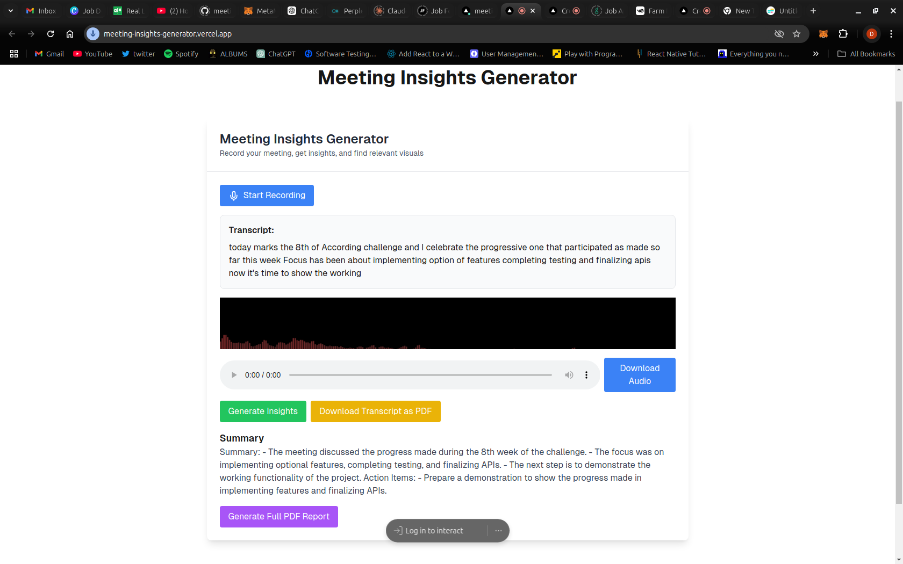

# 🎙️ Meeting Insights Generator

# Overview

Meeting Insights Generator is a powerful web application that helps you transform your meeting recordings into actionable insights. Leveraging advanced speech recognition and AI-powered summarization, this tool allows you to record, transcribe, and analyze your meetings with ease.


Live Link: [https://meeting-insights-generator.vercel.app]


# 🌟 Features

## 🎤 Audio Recording

Real-time audio recording
Live audio visualization
Download original audio recording

## 📝 Transcription

Continuous speech-to-text conversion
Web Speech Recognition API integration
Real-time transcript display
## 📄 Instant PDF Transcript Export

Download full meeting transcript as a PDF
Preserve meeting text for future reference
Easy sharing and archiving


## 💡 AI-Powered Insights

Generate concise meeting summaries
Identify key points and action items
Powered by OpenAI's GPT-3.5 Turbo

## 📊 Export Options

Generate PDF reports with summary and insights
Export full meeting transcript as PDF


## Getting Started

First Clone the repository and run npm install, run the development server:

1. **Clone the Repository**:

   ```bash
   git clone https://github.com/mwihoti/meeting-insights-generator
   cd meeting-insights-generator
   ```
2. **Install Dependencies**:
    ```bash
    npm install
    ```
3. **Set up environment variables**:
Create a .env.local file in the project root:

```bash 
OPENAI_API_KEY=your_openai_api_key_here


```
4  **Run the application**
    ```bash
    npm run dev
    ```

Open [http://localhost:3000](http://localhost:3000) with your browser to see the result.


## 📄 PDF Transcript Export Feature
How It Works

* Record your meeting using the audio recorder
* View the live transcription in real-time
* Click "Download Transcript as PDF" button
* Automatically generate a clean, formatted PDF

## PDF Export Benefits

* Preserves exact meeting transcript
* Professional, readable formatting
* Easy to store and share
* No manual copy-pasting required

## Transcript PDF Details

* Includes full meeting text
* Timestamp options (optional)
* Clean, minimalist design
* Optimized for printing and digital storage

## 🛠️ Tech Stack

* Frontend: React, Next.js
* PDF Generation: Custom PDF utility
* Audio Processing: Web Audio API
* Speech Recognition: Web Speech Recognition API
* Visualization: HTML5 Canvas
* AI Integration: OpenAI API
* Icons: Lucide React


## 📋 Usage Guide

* Click "Start Recording" to begin
* Speak naturally during your meeting
* Watch real-time transcript generation
* Click "Download Transcript as PDF" to export
* Generate Insights: Once the recording is complete, click "Generate Insights" to process the audio and display results.
* Download Reports: Export the transcript and insights as a PDF.
